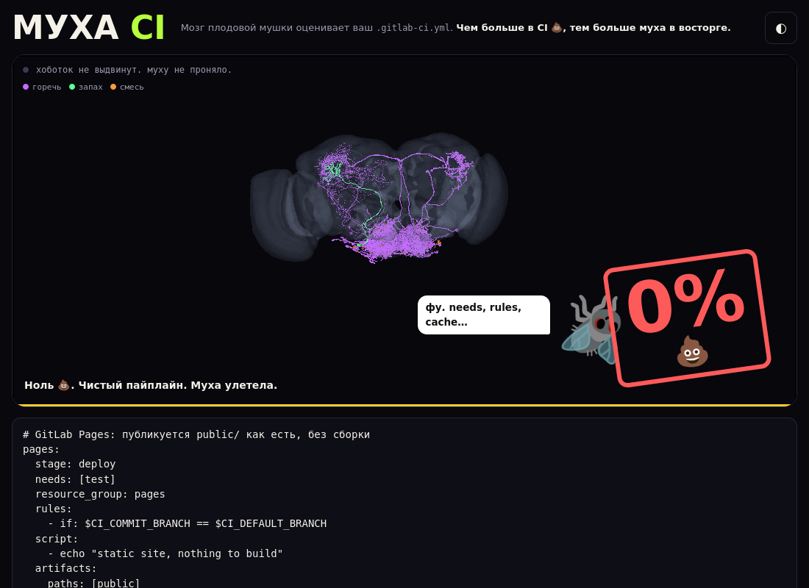

# Муха оценивает ваш CI 🪰

Вставьте `.gitlab-ci.yml` — «мозг мухи» вынесет вердикт, а в 3D видно, как в настоящем коннектоме FlyWire загораются нейроны. **Чем больше в CI 💩, тем больше муха в восторге**: анти-паттерны — сахар, хорошие практики — горечь, секреты — запах. Под вердиктом — список «Что поправить»: что именно плохо, почему и как исправить.

Развлечение и ненавязчивая популяризация хороших практик CI. Не линтер: для настоящей проверки есть CI Lint.

Форк [Brain Rot](https://github.com/Franz23/brainrot) (Franz Schrepf, MIT) с коммита `a001c3f`.

Собственный CI проекта (`.gitlab-ci.yml`) муха оценила так:



## Как это работает

1. Регулярки из `BAIT` (`public/app.js`) раскладывают YAML по пяти чувствам:

   | Чувство | Смысл | Примеры |
   |---|---|---|
   | 🍬 sugar | анти-паттерны | `allow_failure: true`, `:latest`/без тега, `\|\| true`, `curl \| bash`, `sleep`, `only/except`, `privileged`, `chmod 777`, `-k`, ручной деплой в прод, `GIT_DEPTH: 0`, `script:` > 20 строк |
   | 🧪 bitter | хорошие практики | `needs`, `rules`, `workflow`, `cache` с `key`, `interruptible`, `timeout`, `@sha256`, `retry` с `when`, `expire_in`, `resource_group` |
   | 👃 smell | секреты | литералы `*TOKEN*/*PASSWORD*/*SECRET*/*API_KEY*` в `variables`, `echo $TOKEN`, `CI_DEBUG_TRACE`, `set -x` рядом с секретами, `glpat-`, приватные ключи |
   | 👂 sound | отладочный шум | `set -x`, `--verbose`/`-vvv`, `CI_DEBUG_SERVICES`, `echo` в каждой строке |
   | 👁 sight | структура | эмодзи в именах джоб, `extends` глубже 2, много `<<: *`, джобы без `stage` |

   Веса зависят от распространённости паттерна: массовые практики (`rules`, `needs`, ручной гейт на прод) весят мало, редкие (`interruptible`, `timeout`, `@sha256`) — больше.

2. Уровни чувств выбирают один из ~1000 **заранее посчитанных** прогонов модели мозга (Shiu et al. 2024, FlyWire v783, 139 255 нейронов) — `public/runs/S0..S6.json`. Симуляции не пересчитываются; сетка уровней та же, что в оригинале.
3. Вердикт — частота нейрона MN9 (выдвигает хоботок). Горечь его гасит, сильный запах уводит модель в meltdown. `rotScore()` ограничивает процент 💩 размером файла, разнообразием анти-паттернов и числом 💩-чувств (bitter не считается).
4. У каждого правила-проблемы в `BAIT` есть `why` и `fix` — из них собирается список «Что поправить» (секреты первыми). Найденный текст не выводится.
5. 3D — встроенный Neuroglancer (`public/ng/`, Apache-2.0).

Мозг — настоящая модель, но он отвечает на «вкус», а не понимает YAML. Оценивают регулярки.

## Приватность

- Текст CI никуда не отправляется: ни на сервер, ни в аналитику, ни в `localStorage` (там хранится только выбранная тема).
- Сетевые запросы: статика своего origin и меши FlyWire с `storage.googleapis.com` (их тянет браузер пользователя, а не хостинг). Проверено Playwright: при оценке образца других хостов нет.
- Найденные секреты не выводятся и не логируются: в UI только название правила, количество и совет. Это покрыто тестом.

## Запуск

```bash
cd public && python3 -m http.server 8787   # http://localhost:8787
npm test                                    # без зависимостей, Node ≥ 20
```

Темы: светлая и тёмная, по умолчанию — системная, переключатель ◐ в шапке.

## Размещение

- GitHub: `.github/workflows/pages.yml` — `npm test` → `public/` публикуется как есть. Один раз включите Settings → Pages → Source: **GitHub Actions**.
- GitLab: `.gitlab-ci.yml` — то же самое, джоба `pages`.
- Свой сервер — nginx со статикой:

```bash
docker run -d -p 8080:80 -v "$PWD/public:/usr/share/nginx/html:ro" nginx:alpine
```

Сервер должен отдавать `.wasm` как `application/wasm` (nginx и Pages — по умолчанию).

## Отличия от оригинала

- Удалены `api/`, Supabase, Vercel, `@vercel/og`, Hall of Rot, голосование, шаринг в LinkedIn, `?og=1`, OG-теги, Google Fonts (шрифты системные), скачивание картинки, звуки, кнопки-примеры чувств, `sim/`.
- Правила и тексты переписаны под CI, интерфейс на русском.
- В бандле Neuroglancer из оригинала не было wasm-декодера Draco, без него меши нейронов не декодируются. Добавлен `public/ng/09f21dcf7b4f13e8.wasm` — `lib/mesh/draco/neuroglancer_draco.wasm` из npm-пакета `neuroglancer@2.41.2` (Apache-2.0), ABI совпадает.

## Атрибуция

- Brain Rot — Franz Schrepf, MIT (`LICENSE`).
- Коннектом: [FlyWire](https://flywire.ai) v783, CC BY 4.0.
- Модель: [philshiu/Drosophila_brain_model](https://github.com/philshiu/Drosophila_brain_model), [Shiu et al., Nature 2024](https://www.nature.com/articles/s41586-024-07763-9).
- 3D: [Neuroglancer](https://github.com/google/neuroglancer), Apache-2.0 (`public/ng/NOTICE`).
